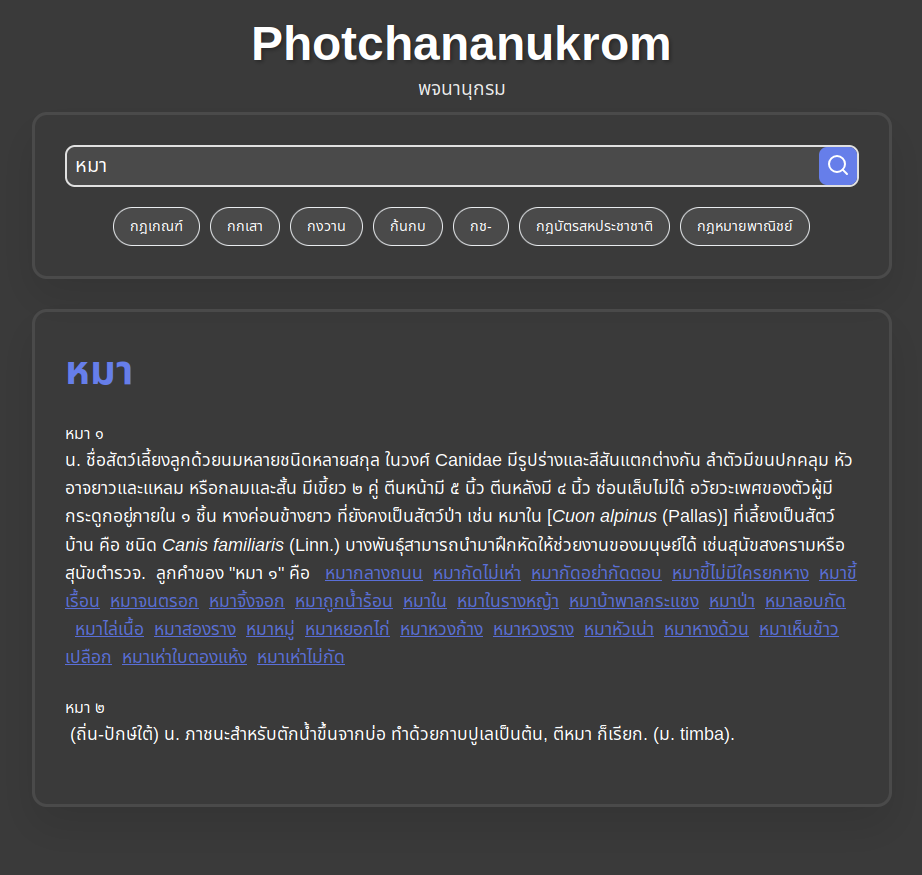

# Photchananukrom

A Thai Dictionary

## Build

Build project with cargo

    cargo build

## Development

With `watchexec` as a hot reloader

    watchexec -e "rs,html" cargo run

With just cargo

    cargo run

## Dataset

Get the dataset here: https://github.com/toftpokk/thai-royal-institute-dictionary-dataset/

To move dataset from json to sqlite

    for i in dataset/*; do
        python data/dataset_sqlite.py "$i"
    done

## Migration
1. `diesel migration generate new_migration`
2. write SQL in new diesel file
3. `diesel migration run`
4. `diesel migration redo` (to recheck)
